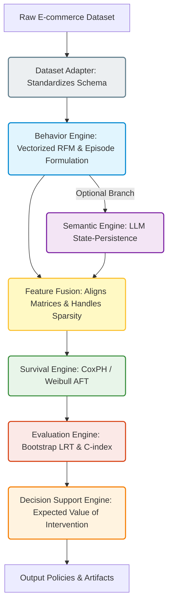

# 3. Proposed Methodology

To overcome the structural limitations of existing churn models, we propose a comprehensive, end-to-end framework: the **Universal Semantic Survival System**. This section details the mathematical and conceptual foundations of our approach, progressing from data formulation to the final Decision Support System (DSS).

## 3.1 Overall System Architecture

The proposed methodology operates on a modular, directed acyclic graph (DAG) architecture. Datasets flow through independent engines, establishing a robust pipeline where the Semantic Engine functions as an optional plugin. This guarantees the framework is universally applicable to datasets even when textual feedback is unavailable.

## 3.2 Dataset Adapter & Behavior Engine: Episode Formulation

The core innovation of our methodology lies in redefining the prediction space. 

**The Historical Flaw:** Traditional e-commerce models define a static "observation window" and a subsequent "performance window". Survival time ($T_{hist}$) is measured from a fixed snapshot date back to the last purchase. Because churn is defined as a lack of purchase over a specific period, the historical *Recency* feature becomes mathematically synonymous with the target variable. This causes **Behavioral Dominance**, preventing the model from learning subtle semantic signals.

**The Proposed Solution:** We shift from a static snapshot to a **forward-looking, episode-centric architecture**. An "episode" is defined as a contiguous period surrounding a customer review. For any given episode $i$ at time $t_i$, the survival time $T_{univ}$ is defined as the elapsed time until the *next* recorded episode $t_{i+1}$:
$$T_{univ} = t_{i+1} - t_i$$

If no subsequent episode occurs before the end of the dataset, the observation is *right-censored* ($E = 0$); otherwise, an event is observed ($E = 1$). 
*Insight:* By resetting the temporal origin ($t_0$) to the moment of each interaction, we force the model to predict *future* behavior based on the current state, completely eliminating historical target leakage.

## 3.3 Semantic Engine: LLM State-Persistence

Once the structural bias is removed, we extract unstructured textual signals to capture customer satisfaction. Instead of relying on crude lexicon averages, we utilize Large Language Models (LLMs) to infer the polarity score $s_j \in [-1, 1]$ of each review. 

Crucially, churn is rarely caused by a single bad review; it is a cumulative process. Therefore, we aggregate these scores into **Semantic Trajectories**. For a sequence of review sentiments $S = \{s_1, s_2, ..., s_k\}$, we compute dynamic features such as:
1. **Net Sentiment:** $\mu_S = \frac{1}{k} \sum s_j$
2. **Semantic Variance:** $\sigma^2_S = \frac{1}{k} \sum (s_j - \mu_S)^2$

*Insight:* Semantic Variance acts as a powerful proxy for volatility. A customer whose reviews flip from $1.0$ (highly positive) to $-1.0$ (highly negative) will exhibit high variance, signaling a sudden breach of expectations and an elevated risk of defection.

## 3.4 Feature Fusion & Survival Engine

To model the time-to-event data and evaluate the combined predictive power of our framework, we employ the **Survival Engine** utilizing a **Cox Proportional Hazards (CoxPH)** model. The hazard function $h(t|X)$ represents the instantaneous risk of churn given a unified feature vector $X$. Crucially, the **Feature Fusion Engine** ensures that vector $X$ is the rigorous concatenation of both the behavioral metrics (extracted via the Behavior Engine) and the LLM semantic trajectories (extracted via the Semantic Engine). 

The hazard function is defined as:

$$h(t|X) = h_0(t) \exp(\beta^T X)$$

where $h_0(t)$ is the baseline hazard and $\beta$ represents the learned coefficients. 

To ensure the model is robust against collinearity (e.g., highly correlated semantic metrics), we apply a variance thresholding filter and introduce a strictly penalized optimization function using an $L_1$ (Lasso) / $L_2$ (Ridge) regularization penalty:
$$\min_{\beta} \left[ -LL(\beta) + \lambda \sum |\beta| \right]$$

*Insight:* Unlike classification models (e.g., Random Forest) that only output a binary Yes/No, CoxPH provides a continuous "risk curve" over time. The exponential term $\exp(\beta)$ directly yields the **Hazard Ratio (HR)**.

## 3.5 Evaluation Engine

To rigorously quantify the true predictive gain of semantic features, the **Evaluation Engine** applies statistical testing rather than relying on point-estimates. We employ $1,000$ paired bootstrap iterations to calculate the 95% Confidence Intervals for the Concordance Index (C-index). Additionally, Likelihood Ratio Tests (LRT) validate the statistical significance of nested model improvements, proving that any performance gain is not due to random chance.

## 3.6 Decision Support Engine (DSE) and Expected Value of Intervention (EVI)

The ultimate goal of churn prediction is prescriptive action. We formulate a **Decision Support System (DSS)** that ranks customers by their predicted partial hazard score and targets the top $N$ highest-risk individuals, bounded by a fixed intervention budget $C_{total}$.

To quantify the economic viability of the model, we define the **Expected Net Benefit (ENB)**. Let $C$ be the cost of a retention intervention (e.g., a promotional voucher) and $V$ be the monetary value of a successfully retained customer. Assuming an intervention success rate of $\gamma$, the expected profit from the targeted cohort is:

$$ENB = \left( \sum_{i=1}^{N} \mathbb{I}(True\ Positive_i) \times \gamma \times V \right) - (N \times C)$$

Consequently, the Return on Investment (ROI) is evaluated as:
$$ROI = \frac{ENB}{N \times C}$$

*Insight:* A model that looks perfectly accurate due to Target Leakage will output a mathematically impossible 100% targeting precision, leading to a fictitious ROI. By utilizing the unbiased Universal predictions, our DSS outputs realistic, deployable economic metrics, ensuring that marketing budgets are allocated efficiently to customers who are genuinely at risk of defection.
